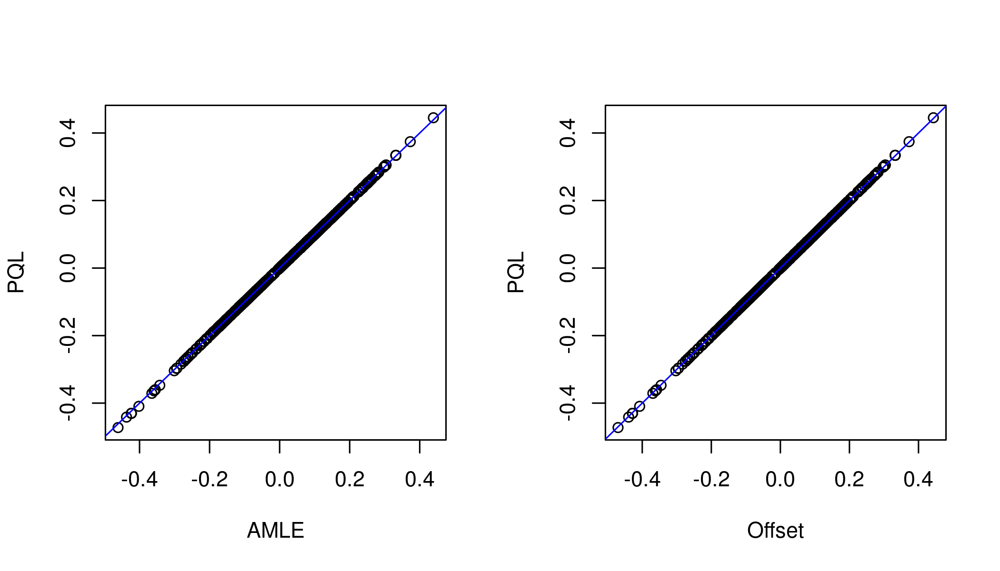
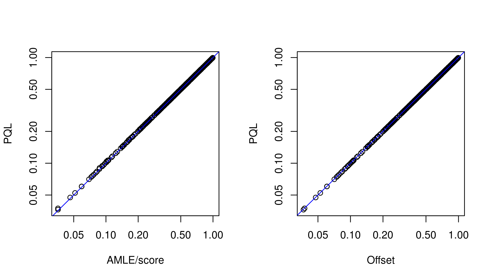
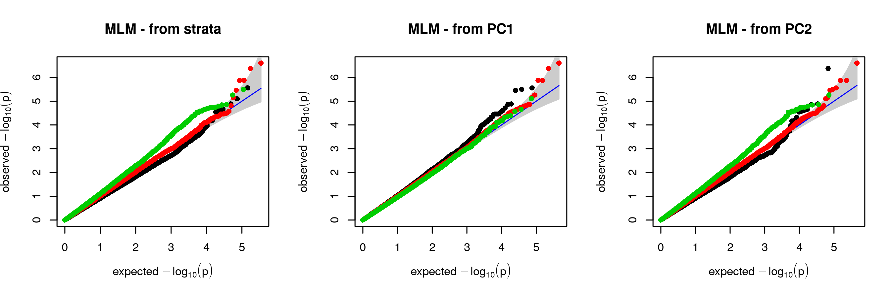
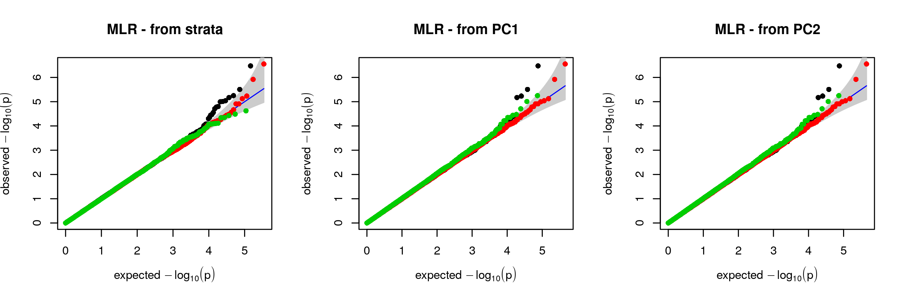

# milorGWAS: MIxed LOgistic Regression in GWAS

This package is for Genome Wide Association Studies using a logistic
mixed model, using fast approximate methods as described in (Milet and
Perdry, 2020). One of these methods extends the GMMAT method by Chen et
al. (Chen et al., 2016). A similar method was described in (Zhou et al.,
2020).

Additionnally, it can draw QQ-plots with a separation of SNPs in strata,
as defined by Chen et al. and extended in Milet and Perdry.

This package relies on the package `gaston`, which we will use in the
following. We are going to illustrate below the functions exported by
`milorGWAS`: `association.test.logistic`, `qqplot.pvalues` (which
replaces and extends the function `gaston::qqplot.pvalues`), and
`SNP.category`.

Running `association.test.logistic`
===================================

Building a small data set
-------------------------

In the following code, after loading the package, we use an example from
`gaston` to simulate a binary phenotype with a random component
*ω* ∼ *N*(0, *τ**K*), in the model
logit*P*(*Y* = 1) = *X**β* + *ω*.

The following lines creates a small genotype matrix `x` containing data
from 1000 genomes, for 503 europeans and 733 SNPs on a region including
the TTN gene (`?TTN` for details). The simulation of the phenotype can
be done as follows.

``` r
library(milorGWAS)
x <- as.bed.matrix(TTN.gen, TTN.fam, TTN.bim)
x
```

    ## A bed.matrix with 503 individuals and 733 markers.
    ## snps stats are set
    ## ped stats are set

``` r
options(gaston.verbose = FALSE)
```

Let’s simulate a random phenotype.

``` r
set.seed(1)
## some covariates : an intercept, and a uniformly distributed covariate.
X <- cbind(1, runif(nrow(x)))
## A random GRM
ran <- random.pm(nrow(x))
## random effects (with variance tau = 1)
omega <- lmm.simu(1, 0, eigenK=ran$eigen)$omega
## linear term of the model
L <- X %*% c(0.1,-0.2) + omega
## vector of probabilities p = expit(L)
p <- 1/(1+exp( -L ))
## vector of binary phenotypes
y <- rbinom(length(p), 1, p)
```

Logistic mixed model with Gaston
--------------------------------

The package `gaston` can analyze these data with the Penalized Quasi
Likelihood method (`a0` below), which is too computationnaly heavy to
scale to a GWAS, or with a score test, similar to GMMAT (Chen et al.,
2016) (`a1` below), which is fast but does not estimate *β*’s for each
SNP.

``` r
a.pql <- association.test(x, y, X, K = ran$K, method = "lmm", response = "bin", test = "wald")
a.gmm <- association.test(x, y, X, K = ran$K, method = "lmm", response = "bin", test = "score")
```

Here are the results for the first 6 SNPs of the data set, which give
similar *p*-values.

``` r
head(a.pql)
```

    ##   chr       pos         id A1 A2    freqA2        tau        beta        sd          p
    ## 1   2 179200322  rs7571247  C  T 0.9025845 0.02676486 -0.36346036 0.2172089 0.09426397
    ## 2   2 179200714  rs3813253  G  A 0.7664016 0.02507730  0.04752710 0.1525129 0.75532412
    ## 3   2 179200947  rs6760059  T  C 0.8399602 0.02617219 -0.08552013 0.1760519 0.62713257
    ## 4   2 179201048 rs16866263  T  G 0.9433400 0.02588978  0.15828800 0.2729198 0.56192813
    ## 5   2 179201380 rs77946091  A  G 0.9433400 0.02589061  0.15828758 0.2729198 0.56192916
    ## 6   2 179201557 rs77711640  A  G 0.9423459 0.02560713  0.12033790 0.2707140 0.65666641

``` r
head(a.gmm)
```

    ##   chr       pos         id A1 A2    freqA2      score          p
    ## 1   2 179200322  rs7571247  C  T 0.9025845 2.83461240 0.09225306
    ## 2   2 179200714  rs3813253  G  A 0.7664016 0.09741459 0.75495457
    ## 3   2 179200947  rs6760059  T  C 0.8399602 0.23637475 0.62683681
    ## 4   2 179201048 rs16866263  T  G 0.9433400 0.33748981 0.56128175
    ## 5   2 179201380 rs77946091  A  G 0.9433400 0.33748981 0.56128175
    ## 6   2 179201557 rs77711640  A  G 0.9423459 0.19810102 0.65625803

Logistic mixed model with milorGWAS
-----------------------------------

MilorGWAS proposes two more methods, named `offset` and `amle` (Milet
and Perdry, 2020, for details). Again we show the results for the six
first SNPs.

``` r
a.ofst <- association.test.logistic(x, y, X, K = ran$K, algorithm = "offset")
a.amle <- association.test.logistic(x, y, X, K = ran$K, algorithm = "amle")
head(a.ofst)
```

    ##   chr       pos         id A1 A2    freqA2        beta        sd          p
    ## 1   2 179200322  rs7571247  C  T 0.9025845 -0.36176887 0.2164701 0.09467853
    ## 2   2 179200714  rs3813253  G  A 0.7664016  0.04734463 0.1520347 0.75549147
    ## 3   2 179200947  rs6760059  T  C 0.8399602 -0.08510584 0.1754785 0.62768126
    ## 4   2 179201048 rs16866263  T  G 0.9433400  0.15752648 0.2720386 0.56254914
    ## 5   2 179201380 rs77946091  A  G 0.9433400  0.15752648 0.2720386 0.56254914
    ## 6   2 179201557 rs77711640  A  G 0.9423459  0.11977405 0.2698536 0.65715228

``` r
head(a.amle)
```

    ##   chr       pos         id A1 A2    freqA2        beta        sd          p
    ## 1   2 179200322  rs7571247  C  T 0.9025845 -0.35834443 0.2128403 0.09225306
    ## 2   2 179200714  rs3813253  G  A 0.7664016  0.04755516 0.1523651 0.75495457
    ## 3   2 179200947  rs6760059  T  C 0.8399602 -0.08537859 0.1756097 0.62683681
    ## 4   2 179201048 rs16866263  T  G 0.9433400  0.15812891 0.2721955 0.56128175
    ## 5   2 179201380 rs77946091  A  G 0.9433400  0.15812891 0.2721955 0.56128175
    ## 6   2 179201557 rs77711640  A  G 0.9423459  0.12029441 0.2702726 0.65625803

The *p*-value from the `amle` method is always the same as the *p*-value
from the score test (GMMAT).

Comparing the results
---------------------

We can compare the *β*’s obtained by the `amle` or `offset` algorithm
with the values obtained with the PQL:

``` r
par(mfrow=c(1,2), cex = 0.9)
plot(a.amle$beta, a.pql$beta, xlab = "AMLE", ylab = "PQL"); abline(0,1,col=4)
plot(a.ofst$beta, a.pql$beta, xlab = "Offset", ylab = "PQL"); abline(0,1,col=4)
```



A similar comparison for the *p*-values (remember that `amle` gives the
same *p*-values than the score test).

``` r
par(mfrow=c(1,2), cex = 0.9)
plot(a.amle$p, a.pql$p, log = "xy", xlab = "AMLE/score", ylab = "PQL"); abline(0,1,col=4)
plot(a.ofst$p, a.pql$p, log = "xy", xlab = "Offset", ylab = "PQL"); abline(0,1,col=4)
```



Stratified qq-plots
===================

Here we will use a simulated structured population with a large number
of SNPs to illustrate the stratified qq-plots. These data simulated as
described in (Chen et al., 2016) or in (Milet and Perdry, 2020) with the
program `ms` (Hudson, 2002). We created a data package for these data.
It includes 600k SNPs at linkage equilibrium for 1000 individuals
simulated on a 20x20 grid. It includes some first-order related
individuals. A binary phenotype was simulated with a large population
structure effect as described in (Milet and Perdry, 2020).

Loading the data
----------------

The package needs to be installed first.

``` r
install.packages("GridData", repos="https://genostats.github.io/R/")
```

Then the data are easily loaded with

``` r
filepath <-system.file("extdata", "GridData.bed", package="GridData")
x <- read.bed.matrix(filepath)
x <- set.stats(x)
```

A look at the data size:

``` r
x
```

    ## A bed.matrix with 1000 individuals and 600000 markers.
    ## snps stats are set
    ## ped stats are set

At the two population strata, which are included in the `x@ped` data
frame:

``` r
table(x@ped$pop)
```

    ##
    ##   0   1
    ## 768 232

At the simulated phenotype:

``` r
table(x@ped$pheno)
```

    ##
    ##   0   1
    ## 877 123

And finally at the relation between strata and phenotype

``` r
table(x@ped$pop, x@ped$pheno)
```

    ##
    ##       0   1
    ##   0 714  54
    ##   1 163  69

Running the association test
----------------------------

The GRM is computed with Gaston, here on the whole set of SNPs (at
linkage equilibrium).

``` r
K <- GRM(x)
eigenK <- eigen(K)
```

We run a Mixed Linear Model (MLM) and a Mixed Logistic Regression (MLR).

``` r
MLM <- association.test(x, method = "lmm", response = "quantitative",
                        test = "wald", eigenK = eigenK, p = 10)
MLR <- association.test.logistic(x,  K = K, eigenK = eigenK, p = 10, algorithm = "amle")
```

Drawing stratified QQ-plots
---------------------------

Now we can draw stratified quantile-quantile plots. We need to defined
SNP categories, which can be done either with the ‘true’ strata
information as described in (Chen et al.,2016), or with the first PCs
(Milet and Perdry, 2020).

The function `SNP.category` can handle any kind of variable: strata
information, or a Principal Component as a proxy.

``` r
# SNPs categories from true strata information
cat.str <- SNP.category(x,x@ped$pop)
# SNPs categories from the first PCs coordinates
cat.PC1 <- SNP.category(x,-eigenK$vectors[,1])
cat.PC2 <- SNP.category(x,-eigenK$vectors[,2])
```

First, the QQ-plots obtained with the mixed linear model, which shows
differences between SNP categories:

``` r
par(mfrow=c(1,3), cex = 0.7)
qqplot.pvalues(MLM, cat.str, col.abline="blue", main="MLM - from strata", pch = 16)
qqplot.pvalues(MLM, cat.PC1, col.abline="blue", main="MLM - from PC1", pch = 16)
qqplot.pvalues(MLM, cat.PC2, col.abline="blue", main="MLM - from PC2", pch = 16)
```



Then, the QQ-plot obtained with mixed logistic regression, in which no
such differences exist.

``` r
par(mfrow=c(1,3), cex = 0.7)
qqplot.pvalues(MLR, cat.str, col.abline="blue", main="MLR - from strata", pch = 16)
qqplot.pvalues(MLR, cat.PC1, col.abline="blue", main="MLR - from PC1", pch = 16)
qqplot.pvalues(MLR, cat.PC1, col.abline="blue", main="MLR - from PC2", pch = 16)
```



References
==========

-   Chen, Z et al. (2016). Testing for association in case-control
    genome-wide association studies with shared controls. *Statistical
    methods in medical research,* 25(2), 954–967.

-   Milet, J and Perdry, H. (2020). *Mixed Logistic Regression in
    Genome-Wide Association Studies.* [Preprint on
    biorxiv.](https://www.biorxiv.org/content/10.1101/2020.01.17.910109v1)

-   Hudson, RR (2002). Generating samples under a Wright–Fisher neutral
    model of genetic variation. *Bioinformatics,* 18(2), 337–33.

-   Zhou, W et al. (2018). Efficiently controlling for case-control
    imbalance and sample relatedness in large-scale genetic association
    studies. *Nature genetics,* 50(9), 1335
